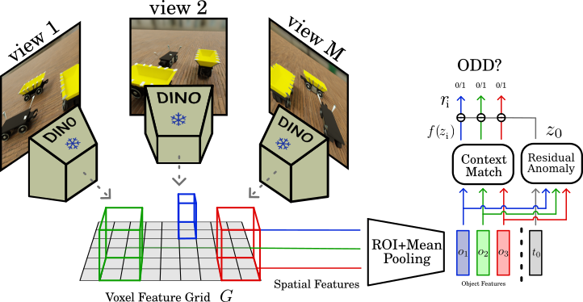

# Efficient Odd-One-Out Anomaly Detection

📚 [arXiv](https://arxiv.org/abs/2509.04326) • [🌐 Project Page](https://silviochito.github.io/EfficientOddOneOut/)



> **Abstract**  
> The recently introduced odd-one-out anomaly detection task
involves identifying the odd-looking instances within a multi-object scene.
This problem presents several challenges for modern deep learning mod-
els, demanding spatial reasoning across multiple views and relational
reasoning to understand context and generalize across varying object cat-
egories and layouts. We argue that these challenges must be addressed
with efficiency in mind. To this end, we propose a DINO-based model
that reduces the number of parameters by one third and shortens training
time by a factor of three compared to the current state-of-the-art, while
maintaining competitive performance. Our experimental evaluation also
introduces a Multimodal Large Language Model baseline, providing in-
sights into its current limitations in structured visual reasoning tasks.

---

# Getting Started

### 🗂️ Download datasets
The ToysAD-8K (40 GB) and PartsAD-15K (94 GB) datasets can be downloaded [here](https://huggingface.co/datasets/ankankbhunia/odd-one-out/tree/main).

ToysAD-8K contains real-world objects from multiple categories, while PartsAD-15K consists of a diverse collection of mechanical object parts.

Both datasets are organized into multiple scene folders, each containing RGB rendered images, masks, and segmentation annotations for each multiview image, along with their metadata. For our purposes, we will use only the RGB folder for each scene.

A script for downloading the datasets is provided in the *data* folder (*download.sh*).

### 🔧 Clone the repository

```bash
git clone https://github.com/yourusername/your-repo-name.git
cd your-repo-name
```

### 📦 Set up the environment
Install dependencies with conda:

```bash
conda env create -f environment.yml -n my_env
conda activate my_env
```

## 🏋️ Train the Model
```bash
python train.py --config_path configs/conf_toys.yaml # training on toys
```
```bash
python train.py --config_path configs/conf_parts.yaml # training on parts
```

## 🔽 Download Checkpoints

You can download the pretrained model checkpoints from the links below:

- [Checkpoint trained on Toys](https://github.com/SilvioChito/EfficientOddOneOut/releases/download/v1.0.0/Checkpoint_Toys.pt)
- [Checkpoint trained on Parts](https://github.com/SilvioChito/EfficientOddOneOut/releases/download/v1.0.0/Checkpoint_Parts.pt)

## 🧪 Run Inference
```bash
python train.py --config configs/conf_toys.yaml --resume_ckpt ./Checkpoint_Toys.pt
```
```bash
python train.py --config configs/conf_parts.yaml --resume_ckpt ./Checkpoint_Parts.pt
```


## 📚 Citation
```bibtex
@misc{chito2025efficientoddoneoutanomalydetection,
      title={Efficient Odd-One-Out Anomaly Detection}, 
      author={Silvio Chito and Paolo Rabino and Tatiana Tommasi},
      year={2025},
      eprint={2509.04326},
      archivePrefix={arXiv},
      primaryClass={cs.CV},
      url={https://arxiv.org/abs/2509.04326}, 
}
```


